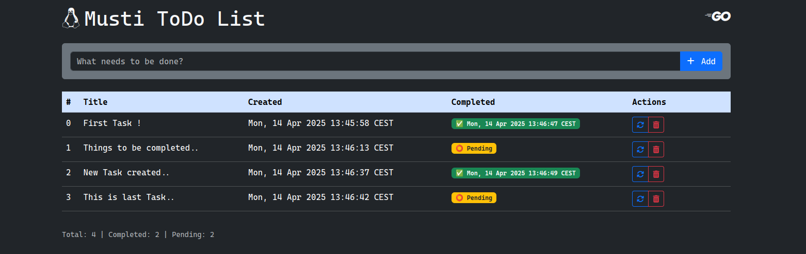
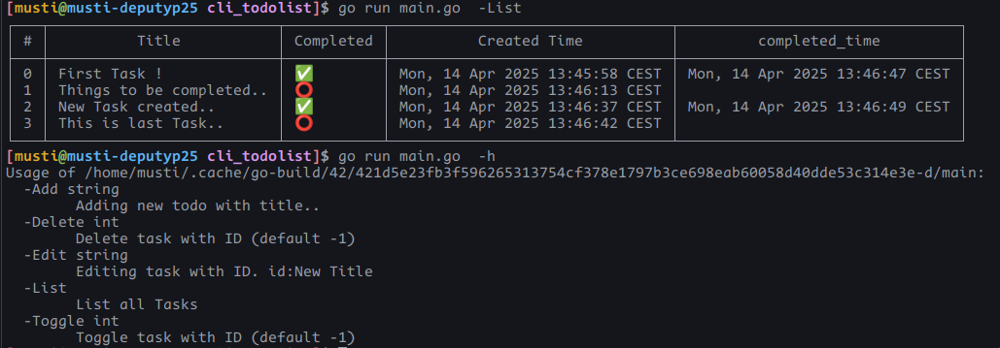

# ToDo CLi and Webserver with GO / HTMX / Templ

Flawless ToDo app which supports cli-linux terminal and web together. It has dynamic change with htmx and beautiful bootstrap css with templ.
Simply do your task;

- List
- Add
- Delete
- Toggle status
- Edit / only for CLi for now ...

## Components:

- Go Core
- Echo Framework for webserver
- Htmx
- Templ

## Code:

[Github Source](http://github.com/mozkaya1/todo-cli-web)

## Screenshot:

### Webserver



### Cli Terminal // Linux



## Usage:

### Cli --

```bash
  go  run main.go -h
```

```bash
Usage of /home/musti/.cache/go-build/42/421d5e23fb3f596265313754cf378e1797b3ce698eab60058d40dde53c314e3e-d/main:
  -Add string
        Adding new todo with title..
  -Delete int
        Delete task with ID (default -1)
  -Edit string
        Editing task with ID. id:New Title
  -List
        List all Tasks
  -Toggle int
        Toggle task with ID (default -1)

```

### webserver --

Run webserver with below command...

```bash
go run server/server.go

```

On Browser

`http://localhost:3000`

List - Json
`http://localhost:3000/list`
